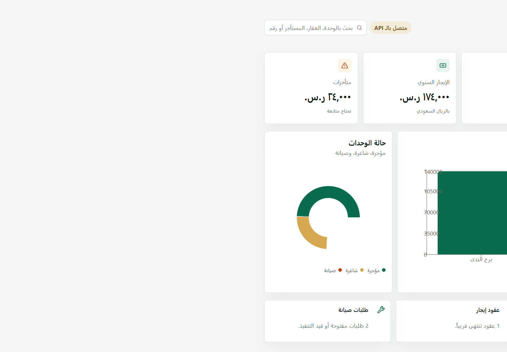
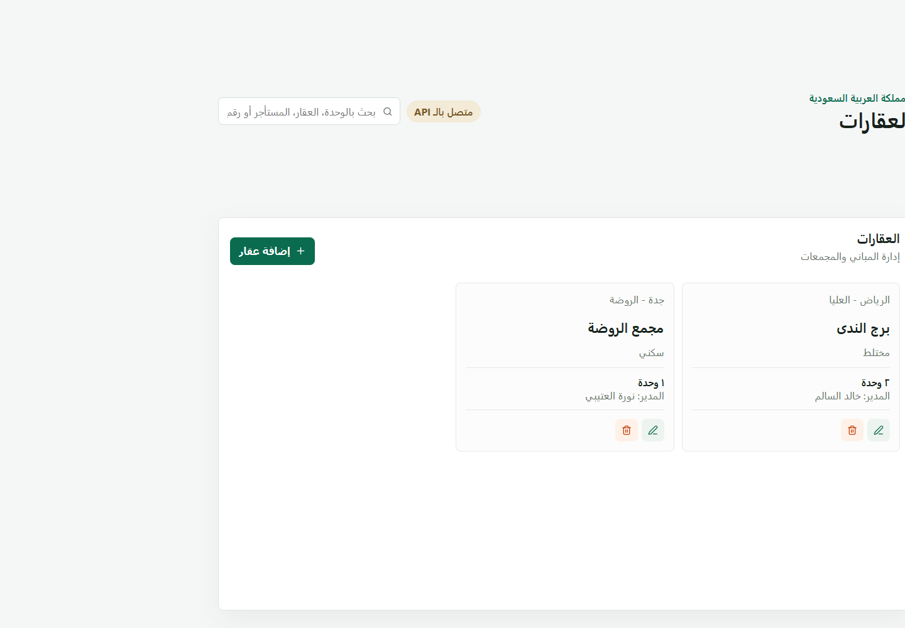
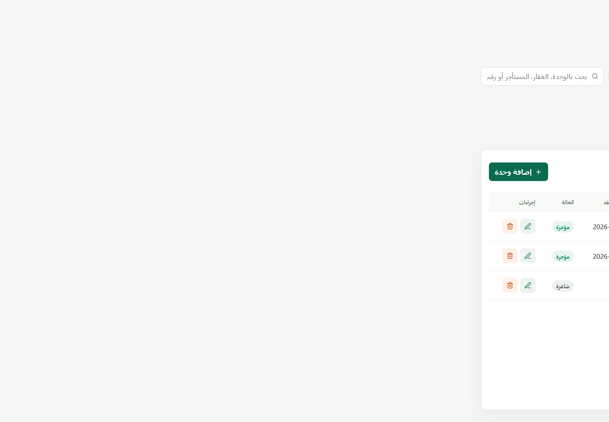
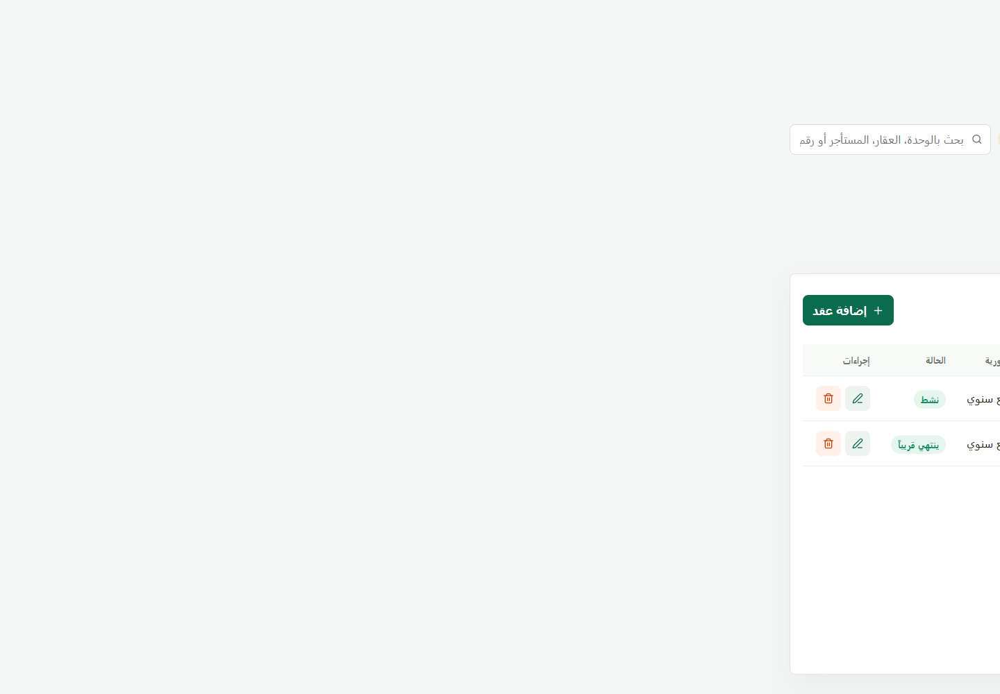
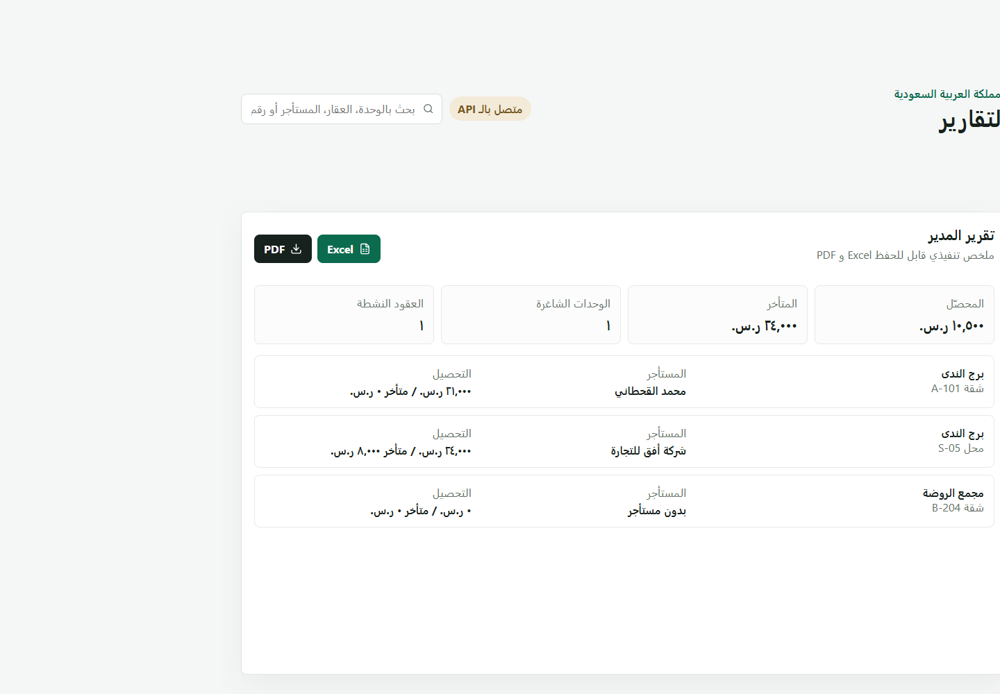

# Aqarati Property Manager

Arabic RTL web app for managing company properties in Saudi Arabia. The app covers buildings, flats, shops, tenants, Ejar contract numbers, payments, maintenance requests, and manager reports with Excel/PDF exports.

> Status: prototype with local backend. Do not use for real sensitive company data until authentication, permissions, validation, backups, and production deployment are complete.

## Features

- Arabic RTL interface.
- SPA navigation with no full page reloads.
- Properties, units, tenants, contracts, payments, maintenance, reports, and settings.
- Saudi-focused fields including SAR currency, Ejar number, VAT flag, flats, and shops.
- Excel and PDF report export.
- Local Express + SQLite API.
- API mode with browser-local fallback when the API is offline.

## Screenshots

### Dashboard



### Properties



### Units



### Contracts



### Reports



## Tech Stack

- React + TypeScript + Vite
- `lucide-react` for icons
- `recharts` for dashboard charts
- `exceljs`, `jspdf`, and `jspdf-autotable` loaded on demand for report exports
- Browser `localStorage` for the current prototype data layer
- Express + SQLite for the local API

## Local Development

```powershell
npm install
npm run dev
```

The dev server runs at:

```text
http://127.0.0.1:3000/
```

Run the local API server in a second terminal:

```powershell
npm run api
```

The API runs at:

```text
http://127.0.0.1:4000/api/health
```

Optional local environment:

```powershell
Copy-Item .env.example .env
```

## Quality Checks

```powershell
npm run check
```

This runs lint, build, and production dependency audit.

## Documentation

- [User Guide](docs/USER_GUIDE.md)
- [Developer Guide](docs/DEVELOPER_GUIDE.md)
- [API Contract](docs/api-contract.md)
- [Production Database Draft](docs/database-schema.sql)
- [Public Release Checklist](docs/PUBLIC_RELEASE_CHECKLIST.md)
- [Roadmap](docs/ROADMAP.md)
- [Contributing](CONTRIBUTING.md)
- [Security](SECURITY.md)

## Current Notes

- Data is stored locally in the browser under `aqarati.*` keys.
- Shared domain types and seed data live in `src/data.ts` so the UI can later switch from `localStorage` to an API/database.
- The first backend draft is documented in `docs/database-schema.sql` and `docs/api-contract.md`.
- A local Express + SQLite API lives in `server/` and writes its development database to ignored `server/data/`.
- Report export libraries are code-split so the main app loads before Excel/PDF code is downloaded.
- Vite may still warn about the lazy Excel export chunk size because `exceljs` is large. This does not block the build.
- The next production step is to replace `localStorage` with a backend database and add user roles.

## Disclaimer

This project is not legal, tax, accounting, or government-integration software. Ejar, VAT, contracts, and payment workflows must be reviewed by qualified professionals before production use.
